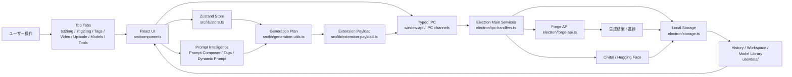

# Project Map

最終更新: 2026-05-25

この地図は人間向けの全体図です。コードの正確な依存関係ではなく、「どの操作がどの層を通って、どこに保存されるか」を読むための入口です。

## 1枚の全体地図

## 地図の使い分け

| 用途 | ファイル |
|---|---|
| AIに最初に読ませる案内板 | `docs/AI_PROJECT_MAP.md` |
| 人間向けの全体把握 | `docs/PROJECT_MAP.md` |
| レイヤと責務 | `docs/maps/00-overview.md` |
| 画像生成の実行経路 | `docs/maps/01-image-generation-flow.md` |
| Prompt / Tags / Composer | `docs/maps/02-prompt-management-flow.md` |
| LoRA / Civitai / Models | `docs/maps/03-lora-civitai-model-flow.md` |
| History / Metadata / Tagger review | `docs/maps/04-history-metadata-flow.md` |
| Electron IPC境界 | `docs/maps/05-electron-ipc-flow.md` |
| Settings / Workspace / userdata | `docs/maps/06-settings-storage-workspace-flow.md` |
| Video / Upscale / Tools | `docs/maps/07-video-upscale-tools-flow.md` |
| 実importの自動サマリ | `docs/maps/generated/import-graph-summary.md` |

## 変更前の読み方

1. 触る画面のタブを特定する。
2. そのタブが使う store slice と IPC namespace を確認する。
3. `src/shared/types.ts` と `src/shared/ipc-channels.ts` に契約変更が必要か判断する。
4. `electron/ipc-handlers.ts` の入力検証と `electron/storage.ts` の保存schemaに副作用がないか確認する。
5. 変更後に該当する地図とDOM QAを更新する。

## 境界線

- Renderer UIは制作体験と一時状態に集中する。
- Electron mainはForge、OS、filesystem、外部API、秘密情報、巨大payload検証を持つ。
- `userdata/` はユーザー資産。QAで触る場合は開始前後に戻す。
- `runtime/forge/` は実行環境。更新、削除、再cloneは検証範囲を明確にしてから行う。
