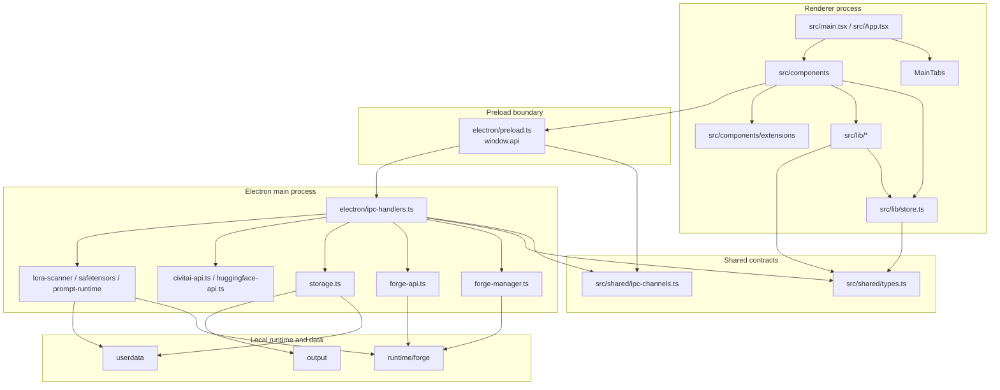

# Overview Map

最終更新: 2026-05-25

## レイヤ構成

## 現在のコード棚卸し

| 項目 | 値 |
|---|---:|
| 対象ソース | `src/`, `electron/`, `scripts/` |
| 静的scan対象ファイル | 93 |
| import edge | 124 |
| 循環依存 | 0件検出 |
| import中心 | `src/lib/store.ts`, `src/components/CollapsiblePanel.tsx`, `src/components/extensions/controls.tsx` |
| fanout中心 | `src/App.tsx`, `src/components/PromptPanel.tsx`, `electron/ipc-handlers.ts` |

詳細は `docs/maps/generated/import-graph-summary.md`。

## 重要な設計判断

- `src/App.tsx` はbootstrapping、Forge ready後のcatalogロード、Generate実行、トップレベルレイアウトを担う。
- `src/lib/store.ts` は単一Zustand store。タブ、生成パラメータ、拡張、Video、Upscale、履歴、Prompt library、LoRA、Civitai状態をまとめる。
- `electron/preload.ts` は `window.api` を公開する唯一の橋。rendererは `src/lib/ipc.ts` からこのAPIだけを使う。
- `electron/ipc-handlers.ts` は入力検証、進捗stream、main service呼び出しの集中点。
- `electron/storage.ts` は `userdata/` のJSON storageと画像/動画/Workspace保存を担う。schema normalizeと破損耐性をここで持つ。
