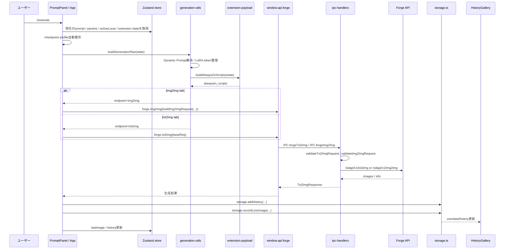

# Image Generation Flow

最終更新: 2026-05-25

## txt2img / img2img sequence

## 関連ファイル

| 役割 | ファイル |
|---|---|
| Generateボタンと結果保存 | `src/App.tsx` |
| endpoint / prompt / params / LoRA / Dynamic Prompt構築 | `src/lib/generation-utils.ts` |
| ADetailer / ControlNet / Regional Prompter / FABRIC / FreeU / Dynamic Thresholding payload | `src/lib/extension-payload.ts` |
| Forge API型 | `src/shared/types.ts` |
| IPC名 | `src/shared/ipc-channels.ts` |
| Renderer API | `electron/preload.ts`, `src/lib/ipc.ts` |
| 入力検証とprogress polling | `electron/ipc-handlers.ts` |
| REST client | `electron/forge-api.ts` |
| 履歴保存 | `electron/storage.ts` |

## 壊しやすい契約

- txt2img tabでは、過去の `inputImage` がstoreに残っていても txt2img を実行する。endpointはactive tabで決まる。
- img2imgは `inputImage` 必須。maskがあれば inpaint request になる。
- Dynamic Promptはseedに依存し、履歴に `dynamicPrompt` metaを残す。
- `buildAlwaysOnScripts` はForge拡張の引数順と名前に強く依存する。
- Preflightのcheckpoint profile関連LoRA / VAE / ControlNet表示は参照情報のみ。生成ブロック、警告数、payload、現在のVAE/ControlNet設定は自動変更しない。
- History保存時は画像順を保つため、`storage.addHistory` を後ろから呼ぶ。
- LoRA usageは `promptDigestOf(plan.strippedPrompt)` とcheckpoint titleで記録する。

## 変更時の検証

- 基本: `npm.cmd run typecheck`
- UI契約: `npm.cmd run qa:dom -- selectors --port=9338`
- Generate系: Forgeを起動して対象DOM QAを直列実行する。
- `extension-payload.ts` を触った場合は、対象拡張の実機smokeを優先する。
