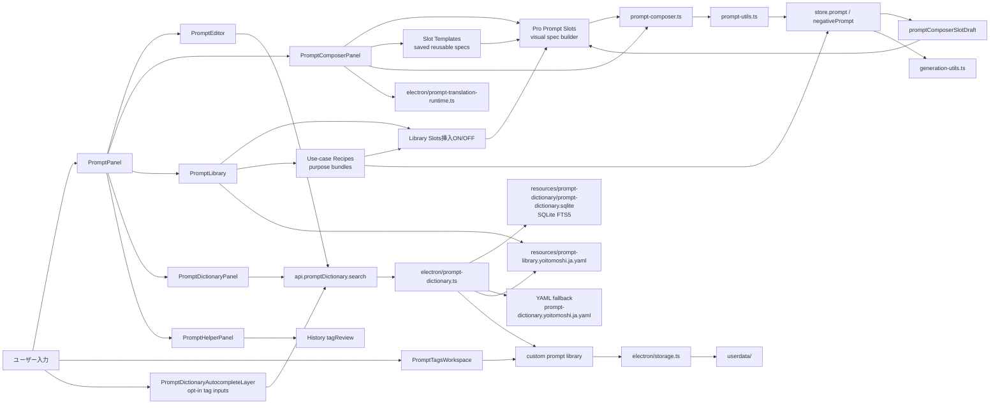

# Prompt Management Flow

最終更新: 2026-05-26

## Prompt ecosystem

## 主な入力源

| 入力源 | 使う場所 | 保存先 |
|---|---|---|
| Prompt / Negative editor | `PromptPanel`, `PromptEditor` | storeのみ。Preset/Workspace/History経由で保存。入力中の現在tokenを `api.promptDictionary.search` で補完し、候補を選ぶと英語Promptタグを挿入 |
| Built-in prompt library | `resources/prompt-library.yoitomoshi.ja.yaml`, `electron/prompt-library.ts` | repo管理 |
| Prompt Daijiten | `PromptDictionaryPanel`, `PromptEditor`, `PromptDictionaryAutocompleteLayer`, `api.promptDictionary.search`, `electron/prompt-dictionary.ts`, `electron/prompt-dictionary-db.ts`, `resources/prompt-dictionary/prompt-dictionary.sqlite` | main側検索サービス経由。SQLite/FTS5の同梱DBを優先し、英語タグと日本語解説を検索してPrompt/Negative/Slot/タグ編集系入力へ挿入。DBが無い開発環境では既存YAML検索へfallback |
| Custom tag library | `PromptTagsWorkspace`, `storage.saveCustom` | `userdata/` |
| Prompt Library Use-case Recipes | `PromptLibrary` | repo管理。Slot挿入ONなら `promptComposerSlotDraft`、OFFならPrompt/Negativeへ追記 |
| Prompt Composer | `PromptComposerPanel`, `prompt-composer.ts`, `prompt-translation-runtime.ts` | 通常の整形/翻訳、モデル別順序のPro Prompt Slots、Slotテンプレート、入力結果のpromptまたはtag library反映 |
| Prompt Composer Slot Templates | `PromptComposerPanel`, `electron/storage.ts` | `userdata/prompt-composer-slot-templates.json` |
| Dynamic Prompt | `DynamicPromptLab`, `dynamic-prompts.ts` | 生成時に解決、履歴にmeta保存 |
| History review tags | `HistoryGallery`, `PromptHelperPanel` | `userdata/history/index.json` の `tagReview` |

## 変更時の注意

- Prompt文字列の区切り、正規化、タグ重複排除を変えると、Prompt Composer、Tag chips、履歴復元、LoRA token stripに影響する。
- Prompt Daijitenはrendererで全件検索せず、`api.promptDictionary.search` でmain側の検索サービスに問い合わせる。現状は `node:sqlite` + SQLite FTS5 の同梱DBを優先し、Custom Libraryをmain側でmergeする。DBが存在しない場合だけ独自辞典YAML、Prompt Library、Custom Libraryを横断するfallbackへ戻す。`PromptEditor` は専用のインライン補完を持ち、それ以外のタグ入力欄は `PromptDictionaryAutocompleteLayer` に `data-prompt-dictionary-autocomplete` で接続する。
- `PromptDictionaryAutocompleteLayer` の対象は Tags Workspace、Prompt Composer slot、Prompt Libraryのタグ追加、ADetailer/Regional Prompter、LoRA prompt override、Checkpoint prompt profile、Tagger blacklist / History review、Character Compose prompt。通常の検索欄、メモ、モデル名、数値欄には付けない。
- 外部辞典本文をコピーせず、Yoitomoshi用に作成・拡張する。ソース来歴とユーザー編集オーバーレイを分ける。
- Prompt Composerは翻訳runtimeが未準備でもcleanup-only導線が残る。runtime準備の失敗でPrompt入力全体を止めない。
- Pro Prompt Slotsは `CheckpointPromptProfile.promptStyle` と `negativeStrategy` を読む。モデルプロファイルを触る変更は `docs/maps/03-lora-civitai-model-flow.md` と合わせて確認する。
- Pro Prompt Slotsのslot draftとLibraryからの挿入ON/OFFは `store.promptComposerSlotDraft` 系で共有する。LibraryクリックがONの時は通常Promptへ入れず、選択slotへ追記する。
- Prompt Libraryの用途別レシピは追記専用。Slot挿入ONの時は各slotへ、OFFの時はPositiveタグをPromptへ、`avoidFailures` だけNegativeへ入れる。
- Slotテンプレートは `store.promptComposerSlotTemplates` と `userdata/prompt-composer-slot-templates.json` に保存し、slot draftへの読込だけを行う。読込時にPrompt本文やNegative本文へは自動反映しない。
- Pro Prompt SlotsのPositive出力順は `promptComposerPositiveSlotOrderForModel()` でモデル系統に合わせる。表示順と出力順をズラさない。`品質 / Score` は独立slotとして扱い、`仕上げ / 後処理` を品質prefix代わりに使わない。
- 「避けたい破綻」スロットだけがNegative Prompt生成元。Positive側の仕様スロットと混ぜない。
- LoRA構文、重み付きタグ、`BREAK`、Dynamic Prompt構文はPrompt Composer parserの保護対象として壊さない。
- Prompt Library YAMLを触った場合は、`js-yaml` parseとカテゴリ/タグ数確認を行う。
- Prompt Daijiten DBを触った場合は、`npm.cmd run dictionary:build` で `resources/prompt-dictionary/prompt-dictionary.sqlite` を再生成し、`手` 検索がhands系を返すことを確認する。
- i18n文言ではなく `data-testid` をDOM QAの契約にする。

## Pro Prompt Slotsのモデル別順序

| 系統 | Positive Prompt順序 |
|---|---|
| Pony | 品質/Score -> 主題 -> 服/小物 -> 表情/ポーズ -> 構図 -> 背景 -> 光 -> 色 -> 質感/画風 -> 仕上げ |
| Animagine | 主題 -> 服/小物 -> 表情/ポーズ -> 構図 -> 背景 -> 光 -> 色 -> 質感/画風 -> 仕上げ -> 品質/Score |
| Illustrious / NoobAI / SD1.5 / Unknown | 品質/Score -> 主題 -> 主要詳細 -> 構図/背景/光 -> 質感/画風 -> 仕上げ |
| Flux / Natural | 主題 -> 構図/行動 -> 服/小物 -> 背景 -> 光/色 -> 質感/画風 -> 仕上げ -> 品質/Score |

## 変更時の検証

- `npm.cmd run typecheck`
- Prompt editor dictionary: `npm.cmd run qa:dom -- prompt-editor-dictionary --port=9338`
- Prompt global autocomplete: `npm.cmd run qa:dom -- prompt-global-autocomplete --port=9338`
- Prompt Composer: `npm.cmd run qa:dom:prompt-composer -- --port=9338`
- Prompt format: `npm.cmd run qa:dom:prompt-format -- --port=9338`
- Prompt Helper / History連携: `npm.cmd run qa:dom:prompt-helper-review -- --port=9338`
- YAML変更時: `resources\prompt-library.yoitomoshi.ja.yaml` のparse確認
