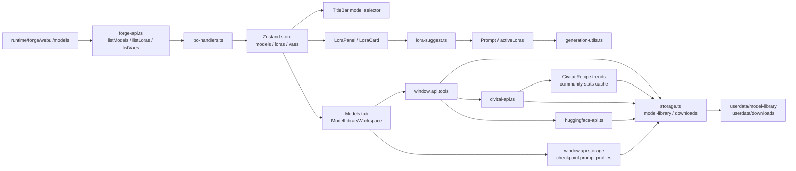

# LoRA / Civitai / Model Flow

最終更新: 2026-05-25

## Model and LoRA flow

## 主要責務

| 領域 | ファイル | 責務 |
|---|---|---|
| Forge catalog | `electron/forge-api.ts` | Forge REST APIからcheckpoint / LoRA / VAE / ControlNet / upscaler catalogを取得 |
| Model Library | `src/components/ModelLibraryWorkspace.tsx`, `ToolsWorkspace.tsx`, `electron/storage.ts` | ローカルモデル索引、Civitai metadata、preview、favorite、notes、checkpoint prompt profile編集 |
| Civitai | `electron/civitai-api.ts`, `CivitaiSearchModal` | 検索、hash照合、metadata取得、download、community stats |
| Hugging Face | `electron/huggingface-api.ts`, Tools内検索 | モデル検索とdownload導線 |
| LoRA suggestion | `src/lib/lora-suggest.ts`, `src/lib/builtin-lora-presets.ts` | Prompt digest、usage履歴、trigger word、checkpoint文脈から提案 |
| Checkpoint prompt profile | `src/lib/checkpoint-prompt-profile.ts`, `GenerationPreflightPanel.tsx` | checkpoint familyごとのPrompt整形、Prompt形式、Negative方針、推奨params、推奨比率、LoRA数、関連LoRA/VAE/ControlNet、Preflight差分 |

## 壊しやすい契約

- `selectedModelTitle` はForge側のcheckpoint titleと一致する必要がある。
- `selectedVae` は `Automatic` と `None` を明示値として扱う。
- active LoRAはPrompt内の `<lora:...>` tokenとstore上の `activeLoras` の両方に関係する。
- Download jobは `.partial` と `userdata/downloads/jobs.json` を前提に再開可能にする。`running` のまま残ったjobは、現在のプロセスで実行中なら破棄/再開しない。stale化したjobだけModel LibraryのDownload / partial整理パネルから復旧または破棄する。
- Orphan `.partial` は DownloadJob に紐づかない一時ファイルとして、整合性チェック結果の専用リストに分けて表示する。削除IPCはForge model folder配下かつ `.partial` を含むファイルだけを許可する。
- Model Libraryのpreviewやmetadataは欠損してもアプリ起動を止めない。
- `ModelSourceMetadata.trainedWords` / `recommendedPrompts` はCivitai由来の制作ヒント。Prompt ComposerやModel Libraryのchipへ渡すが、起動時に外部APIは叩かない。
- Civitai Recipe傾向は `userdata/civitai/community-<modelVersionId>.json` に14日cacheし、Model Libraryではユーザー操作時だけ読む。
- Community miningの既定は `nsfw=false`。必要な拡張を入れる場合も明示操作にする。
- Checkpoint prompt profileは既存JSONの後方互換を守る。`baseModel`、`promptStyle`、`negativeStrategy`、`recommendedAspectRatios`、`recommendedLoraCount`、`relatedModels`、`compatibilityNotes`、`recipeNotes` は欠損・不正値を正規化して扱う。
- `relatedModels` はcheckpointを親にして、関連LoRA / VAE / ControlNetを `name`, `role`, `weight`, `notes` 付きで保存する。これはモデルファイル自体を移動・削除せず、制作上の対応関係をProfileへ集約するためのメモリ層として扱う。
- PreflightとPrompt Composerは `relatedModels` を非ブロッキングの関連メモとして表示する。関連LoRA/VAE/ControlNetは自動適用せず、次の操作候補として参照する。
- Preflightのモデルプロファイル警告と関連メモは、表示文言ではなく `data-testid="preflight-item-..."` / `data-testid="preflight-related-..."` と状態属性でDOM QAする。

## 変更時の検証

- `npm.cmd run typecheck`
- Model Library系: `npm.cmd run qa:dom:model-profile-pro -- --port=9338`、`npm.cmd run qa:dom:model-library-recipe -- --port=9338`、`npm.cmd run qa:dom:workspace-preflight -- --port=9338` または対象DOM QA
- Civitai downloadやhash照合を触る時は実ファイルを破壊しないfixtureで確認する。
- LoRA generation smokeでは対象checkpointとtrigger/weightを明示する。
