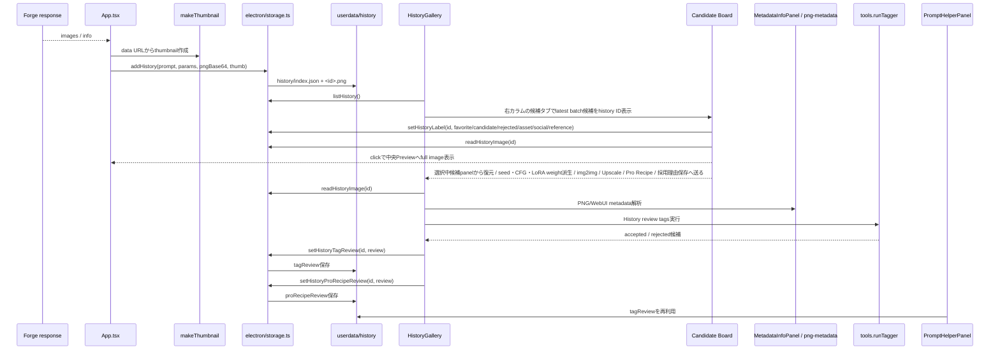

# History / Metadata Flow

最終更新: 2026-05-26

## History data flow

## 保存されるもの

| データ | 主な保存先 | 備考 |
|---|---|---|
| full image | `userdata/history/<id>.png` | 生成結果本体 |
| thumbnail | `userdata/history/index.json` | History一覧用 |
| prompt / params / activeLoras / dynamicPrompt | `userdata/history/index.json` | 復元と比較に使う |
| batchSize / imageIndex / imageCount | `userdata/history/index.json` | Candidate Boardのbatch比較と順序表示に使う |
| label | `userdata/history/index.json` | favorite / candidate / rejected / asset / social / reference。History quick filter と FABRIC import の入力 |
| tagReview | `userdata/history/index.json` | History review / Tagger比較 / Prompt Helperの連携元。accepted / rejected tags は横断検索対象 |
| proRecipeReview | `userdata/history/index.json` | Pro Recipe評価。rating、強み、弱点、次に試すことを保存し、一覧カードとCandidate Boardにも要点を表示 |
| Upscale comparison | `userdata/upscale-comparisons/` | 候補画像と判断材料 |
| Character composite | `userdata/character-composites/` | 配置画像、mask、report |

## 変更時の注意

- History schemaを変える場合は、古い `index.json` が壊れていても起動不能にしない。
- History一覧は497件規模を前提にin-memory filterしている。検索対象は prompt / negative / model / sampler / LoRA / tagReview / Pro Recipe rating・notes / label。quick filterは成功レシピ/お気に入り/没/素材/SNS向け/参考用/Pro Recipe、rating filterは5のみ/4以上/3以上/未評価を扱う。大規模化する場合はstorage側paginationを検討する。
- `tagReview` は複数機能が読む。QAで一時変更する場合は開始前後に戻す。
- `proRecipeReview` は制作判断用。タグ正解データの `tagReview` と混ぜず、専用IPCで保存する。
- Candidate Boardは右カラムの独立タブとして表示する。画像本体を新規stateへ複製せず、history IDを起点に必要時だけ `readHistoryImage(id)` で次工程へ渡す。
- 生成完了時に2枚以上のbatchが保存された場合は、右カラムをCandidate Boardタブへ切り替える。単枚生成は通常のHistory保存に留める。
- Candidate Board上の候補画像をクリックすると、履歴のfull imageを読み直して中央Previewへ表示し、同時に選択中候補panelへseed、model、steps、CFG、size、Pro Recipeメモを集約する。
- Candidate Boardはlabel集計と「没を隠す」導線を持つ。比較後は選択中候補panelから採用理由/失敗理由/次に試すことを保存し、復元、seed+1、CFG±0.5、LoRA weight±0.05、img2img、Upscale、Pro Recipeへ送る。
- Candidate Boardの派生ボタンは自動生成しない。選択候補を復元し、変更した生成設定を `txt2img` へ送るだけに留める。
- PNG metadata解析は外部画像にも使われるため、生成履歴だけを前提にしない。

## 変更時の検証

- `npm.cmd run typecheck`
- `npm.cmd run qa:dom:history-review -- --port=9338`
- `npm.cmd run qa:dom:history-review-persistence -- --port=9338`
- `npm.cmd run qa:dom:history-review-prompt -- --port=9338`
- `npm.cmd run qa:dom:history-review-report-source -- --port=9338`
- `npm.cmd run qa:dom:candidate-board -- --port=9338`
