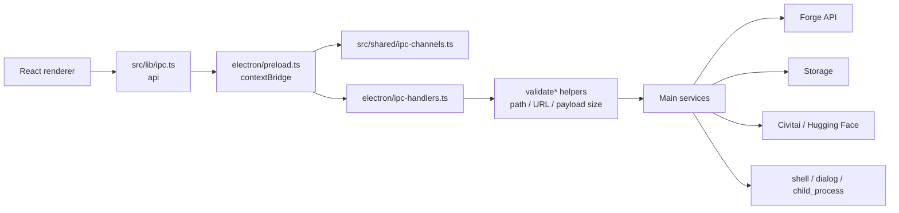

# Electron IPC Flow

最終更新: 2026-05-26

## IPC boundary

## IPC追加時の手順

1. `src/shared/types.ts` にrequest / response型を置く。
2. `src/shared/ipc-channels.ts` にchannel名を追加する。
3. `electron/preload.ts` の `api` にrenderer向け関数を追加する。
4. `electron/ipc-handlers.ts` に `ipcMain.handle` と入力検証を追加する。
5. renderer側は `src/lib/ipc.ts` 経由で `api.*` を呼ぶ。
6. DOM QAやAPI surface QAがある場合は更新する。

## namespaceの目安

| namespace | 代表channel | 用途 |
|---|---|---|
| `forge` | `forge:txt2img`, `forge:img2img`, `forge:list-models` | Forge lifecycle / REST passthrough / progress |
| `videoBackends` | `framepack:*` | FramePack外部連携 |
| `tools` | `tools:*` | model health, tagger, merger, format converter, library |
| `civitai` | `civitai:*` | Civitai検索、照合、download、metadata |
| `huggingFace` | `huggingface:*` | Hugging Face検索/download |
| `storage` | `storage:*` | settings, history, presets, workspace, generated media |
| `library` | `library:*` | built-in/custom Prompt library |
| `promptDictionary` | `prompt-dictionary:*` | Prompt大辞典の検索。rendererへ全件ロードせず、main側でSQLite/FTS5 DB優先、YAML fallback、Custom Library mergeを行う |
| `translation` | `translation:*` | Prompt tag/text translation runtime |
| `app` | `app:*` | startup metrics, external URL, folder open, directory select |

## History review IPC

| channel | 用途 |
|---|---|
| `storage:set-history-label` | favorite / candidate / rejected / asset のラベル保存 |
| `storage:set-history-tag-review` | tagger由来の正解/除外タグ保存 |
| `storage:set-history-pro-recipe-review` | Pro Recipe評価、強み、弱点、次に試すことの保存 |

## 安全上の注意

- RendererへNode機能を直接渡さない。`contextIsolation` + `window.api` を維持する。
- 外部URLはallowlistで制限する。
- ファイルパスは絶対/相対/保存先境界をmain側で検証する。
- base64画像、video、script args、alwayson_scriptsはサイズ上限を維持する。
- shell操作やchild_process実行はmain側の検証済み用途に限定する。

## 変更時の検証

- `npm.cmd run typecheck`
- `npm.cmd run qa:dom:api -- --port=9338`
- UIから呼ぶIPCなら該当タブのDOM QAを追加または更新する。
