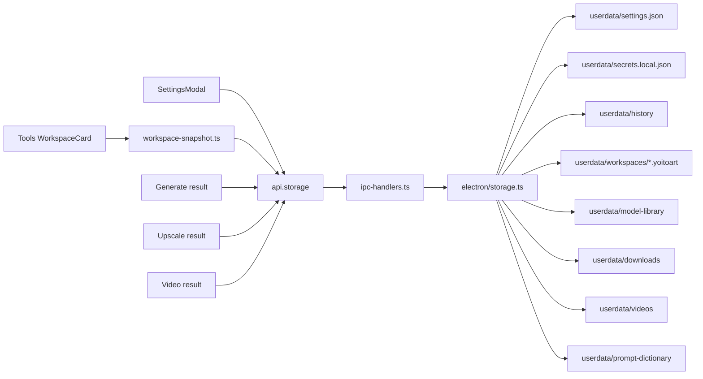
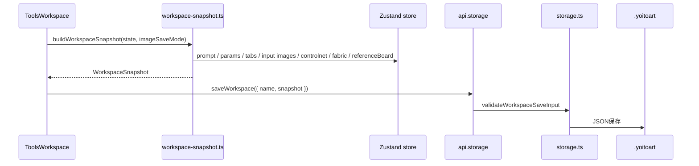

# Settings / Storage / Workspace Flow

最終更新: 2026-05-26

## Storage layout flow

## userdataの主な責務

| path | 役割 |
|---|---|
| `userdata/settings.json` | Forge path、port、autoStartForge、UI languageなど |
| `userdata/secrets.local.json` | Civitai API keyなどlocal秘密情報 |
| `userdata/history/` | 生成履歴PNG、thumbnail、params、tagReview |
| `userdata/model-library/` | ローカルモデル索引、Civitai metadata、preview |
| `userdata/downloads/` | download job manifest、再開情報 |
| `userdata/workspaces/` | `.yoitoart` workspace snapshot |
| `userdata/upscale-comparisons/` | Upscale比較結果 |
| `userdata/character-composites/` | AIキャラ追加のcomposite/mask/report |
| `userdata/videos/` | 生成/取り込み動画 |
| `userdata/prompt-dictionary/` | Prompt大辞典の将来のユーザー上書きDB、import、backup。ベースDBは `resources/prompt-dictionary/` |

## Workspace snapshot

## 変更時の注意

- `settings.json` はBOMや破損があっても復旧できるようにする。
- `secrets.local.json` やAPI keyをdocsやgitに出さない。
- Workspace画像は `embed` / `references` / `settings-only` の3モードがある。参照保存では履歴IDと外部画像パスの欠落をpreflightする。
- Reference BoardはWorkspace snapshotの `referenceBoard.items` に分類、由来メモ、source情報を持つ。`embed` は画像本体も保存し、`references` は `imageReferences.referenceBoard[]` の履歴ID/外部パスから復元し、`settings-only` は画像を含めずメモだけ残す。
- `runtime/` と `userdata/` の物理削除は通常のdocs/コード作業では行わない。

## 変更時の検証

- `npm.cmd run typecheck`
- `npm.cmd run qa:dom:workspace-preflight -- --port=9338`
- `npm.cmd run qa:dom:reference-board -- --port=9338`
- Workspace restore導線を触る場合は `docs/QA_WORKSPACE_RESTORE_2026-05-12.md` の前提を確認する。
