# Video / Upscale / Tools Flow

最終更新: 2026-05-26

## Independent workspaces

```mermaid
flowchart TB
    Tabs["MainTabs"] --> Video["VideoWorkspace"]
    Tabs --> Upscale["UpscaleWorkspace"]
    Tabs --> Models["ModelLibraryWorkspace"]
    Tabs --> Tools["ToolsWorkspace"]

    Video --> VideoPanel["VideoGenerationPanel"]
    VideoPanel --> ForgeVideo["Forge AnimateDiff support"]
    VideoPanel --> FramePack["FramePack backend"]
    VideoPanel --> VideoStorage["storage.saveGeneratedVideo"]

    Upscale --> Extra["forge.extraSingleImage"]
    Upscale --> Diffusion["forge.img2img + MultiDiffusion"]
    Upscale --> Ultimate["Ultimate SD upscale script_args"]
    Upscale --> UpscaleStorage["storage.saveUpscaleComparison"]
    Upscale --> HistoryRecipe["History + Pro Recipe review"]

    Models --> ModelLibrary["ModelLibraryCard"]
    ModelLibrary --> Civitai["Civitai metadata / preview"]
    ModelLibrary --> Downloads["Download jobs"]

    Tools --> PersonalHealth["Personal environment health"]
    PersonalHealth --> Startup["Startup diagnostics"]
    PersonalHealth --> Recovery["Download / Model Library recovery"]
    PersonalHealth --> SafeRecovery["Safe recovery IPC"]
    PersonalHealth --> ForgeSignals["Forge ready phase signals"]
    Tools --> Health["Catalog / model health"]
    Tools --> Tagger["Tagger"]
    Tools --> Merger["Model Merger"]
    Tools --> Converter["Format Converter"]
```

## Workspace別の責務

| Workspace | 主なファイル | 注意点 |
|---|---|---|
| Video | `VideoWorkspace.tsx`, `VideoGenerationPanel.tsx`, `video-generation.ts`, `ipc-handlers.ts` | AnimateDiff / FramePackの可用性確認、短尺・8GB VRAM寄りの既定値 |
| Upscale | `UpscaleWorkspace.tsx`, `upscale-suggest.ts`, `extension-payload.ts` | Simpleは `/extra-single-image`、Diffusion/Ultimateはimg2img系。prompt-panel拡張が混入しないようctx分岐を維持 |
| Models | `ModelLibraryWorkspace.tsx`, `ToolsWorkspace.tsx`, `storage.ts`, `civitai-api.ts` | model-library index、metadata/preview、favorite/notes、download job |
| Tools | `ToolsWorkspace.tsx`, `ipc-handlers.ts`, `storage.ts`, `forge-manager.ts`, `safetensors-inspect.ts`, `tagger-catalog.ts` | 個人環境ヘルスチェック、実ファイル操作、モデル変換、merger、Tagger、partial削除はmain側検証を必須にする |

## 壊しやすい契約

- Upscale Diffusionでは `buildAlwaysOnScripts(state, { forUpscaleDiffusion: true })` を使い、PromptPanel側のADetailer/FABRIC/Regional Prompterなどを混ぜない。
- Ultimate SD upscaleはscript_args順が契約。個数や順序を変える時は実機smokeが必要。
- Upscale仕上げチェックはHistory保存時に `setHistoryProRecipeReview` で採用設定、失敗チェック、メモをPro Recipeへ残す。元の入力履歴は自動で書き換えない。
- VideoはForge AnimateDiffとFramePack外部連携で実行経路が分かれる。
- Toolsはユーザーモデルやruntimeに触る。削除・移動・変換はfixtureか明示確認つきで行う。
- Personal environment health は診断と安全復旧の入口。settings、process、download、library、startup signalを読む。
- Safe recovery IPC は `settings.json` 正規化、stale running DownloadJob整理、Model Library復旧だけを自動実行する。残プロセス停止や孤立 `.partial` 削除は手動確認対象にして、破壊的な停止/削除は専用IPC側の境界チェックを通す。
- Model Libraryの Download / partial整理パネルは running / stale / failed / orphan partial を分けて表示する。実行中downloadは破棄/再開させず、stale化したrunning jobだけ復旧・再開・破棄の対象にする。
- Forge API-only 起動は `forge-manager.ts` で direct `launch.py` 起動に集約する。繰り返し起動では `.yoitomoshi-install-ready.json` が現在なら `--skip-install` と `--skip-torch-cuda-test` を追加し、`--disable-console-progressbars` / `--no-prompt-history` / telemetry抑制envで起動負荷を減らす。Hugging Face cache は deprecated `TRANSFORMERS_CACHE` ではなく、Forge標準の `models/diffusers` を `HF_HOME` / `HF_HUB_CACHE` 系で渡す。`--skip-load-model-at-start` や `--disable-extra-extensions` は既定にしない。前者は初回生成へ待ち時間を移し、後者はADetailer/Regional Prompter/AnimateDiff/Ultimate等の制作機能を壊す可能性があるため。

## 変更時の検証

- `npm.cmd run typecheck`
- Video: `npm.cmd run qa:dom:comfy-v2-video -- --port=9338` など該当smoke
- Upscale: `npm.cmd run qa:dom:upscale-finish -- --port=9338`。Forge実生成系は必要に応じて `forge-core-smoke` / 実機比較で直列確認。
- Personal Health: `npm.cmd run qa:dom:personal-health -- --port=9338`
- Tagger: `npm.cmd run qa:dom:tagger -- --port=9338`
- Partial delete: `npm.cmd run qa:dom:partial-delete -- --port=9338`。通常名のpartialでは実行しない。
